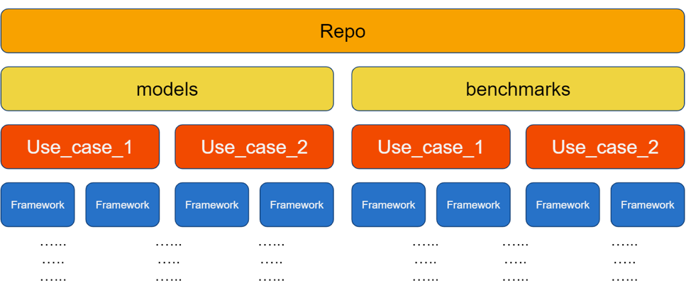

# Model Zoo for Intel® Architecture

This repository contains **links to pre-trained models, benchmarking scripts, best practices, and step-by-step tutorials** for many popular open-source machine learning models optimized by Intel to run on Intel® Xeon® Scalable processors. 

## Purpose of the Model Zoo

  - Demonstrate the AI workloads and deep learning models Intel has optimized and validated to run fast on Intel hardware
  - Show how to efficiently execute, train, and deploy Intel-optimized models
  - Make it easy to benchmark model performance on Intel hardware
  - Make it easy to get started running Intel-optimized models on Intel hardware in the cloud or on bare metal

## How to Use the Model Zoo

### Getting Started
- If you know what model you are interested in, or if you want to see a full list of models in the Model Zoo, start **[here](/benchmarks)**.
- For framework best practice guides, and step-by-step tutorials for some models in the Model Zoo, start **[here](/docs)**.

### Directory Structure
The Model Zoo is divided into four main directories:
- **[benchmarks](/benchmarks)**: Look here for benchmarking scripts and complete instructions on downloading and benchmarking each Intel-optimized pre-trained model.
- **[docs](/docs)**: General best practices and detailed tutorials for a selection of models and frameworks can be found in this part of the repo. 
- **[models](/models)**: This directory contains optimized model code that has not yet been upstreamed to its respective official repository, such as dataset processing routines. 
  There are no user-friendly READMEs in this directory, but many supporting modules used for benchmarking are here.
- **[tests](/tests)**: Look here for unit tests and information on how to run them. 

The benchmarks, models, and docs folders share a common structure. Each model (or document) is organized first by *use case* and then by *framework*. 
Inside the model-specific directory, there may be further nesting subdirectories for inference vs. training and FP32 vs. Int8 precision. 
We hope this structure is intuitive and helps you find what you are looking for; when in doubt, consult the section's main README. 

## How to Contribute

Coming soon