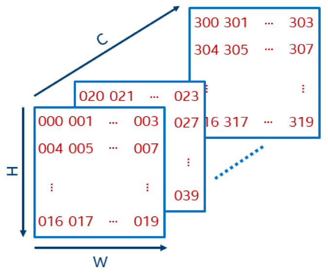

# General Best Practices for Intel-Optimized TensorFlow Serving

## Introduction

On Intel architectures, Intel-Optimized TensorFlow Serving built with MKL-DNN can perform inferencing tasks significantly faster than the default installation.
To install Intel-Optimized TensorFlow Serving, please refer to the [TensorFlow Serving Installation Guide](InstallationGuide.md).
Here we provide a brief description of the available TensorFlow model server settings and some general best practices for optimal performance.
Due to potential differences in environment, memory, network, model topology, and other factors,
we recommend that you explore a variety of settings and hand-tune TensorFlow Serving for your particular workload and metric of interest,
but the following information will help you get started.

## Performance Metrics

* **Throughput** measures how many input tensors can be processed per second with batches of size greater than one.
Typically for maximum throughput, optimal performance is achieved by exercising all the physical cores on a socket.
* **Latency** (also called real-time inference) is a measurement of the time it takes to process a single input tensor, i.e. a batch of size one.
In a real-time inference scenario, optimal latency is achieved by minimizing thread launching and orchestration between concurrent processes.
This guide will help you set your TensorFlow model server options for good balanced performance over both metrics.
However, if you want to prioritize one metric over the other or further tune TensorFlow Serving for your specific model, see the tutorials.

## TensorFlow Serving Configuration Settings

There are two parameters you need to set when running the TensorFlow Serving with MKL-DNN docker container.
* ***OMP_NUM_THREADS*** is the maximum number of threads available. A good guideline is to set it equal to the number of physical cores.
* ***TENSORFLOW_SESSION_PARALLELISM*** is the number of threads to use for a TensorFlow session.
A good guideline we have found by experimenting is to set it equal to one-quarter the number of physical cores
(you may want to start with this suggestion but then try other values, as well).
The number of physical cores (referred to from now on as *num_physical_cores*) may be different from the number of logical cores or CPUs and can be found in Linux with the `lscpu` command.

### Example

To compute *num_physical_cores*, execute the `lscpu` command and multiply `Core(s) per socket` by `Socket(s)`.
For example, *num_physical_cores* = 16 * 1 = 16 for a machine with this `lscpu` output:
```
$lscpu
Architecture:          x86_64
CPU op-mode(s):        32-bit, 64-bit
Byte Order:            Little Endian
CPU(s):                32
On-line CPU(s) list:   0-31
Thread(s) per core:    2
Core(s) per socket:    16
Socket(s):             1
NUMA node(s):          1
Vendor ID:             GenuineIntel
CPU family:            6
Model:                 85
Model name:            Intel(R) Xeon(R) CPU @ 2.00GHz
Stepping:              3
CPU MHz:               2000.168
BogoMIPS:              4000.33
Hypervisor vendor:     KVM
Virtualization type:   full
L1d cache:             32K
L1i cache:             32K
L2 cache:              256K
L3 cache:              56320K
NUMA node0 CPU(s):     0-31
Flags:                 fpu vme de pse tsc ...
```
Next, compute ***OMP_NUM_THREADS*** = *num_physical_cores* = 16 and ***TENSORFLOW_SESSION_PARALLELISM*** = *num_physical_cores*/4 = 4
and start the model server container from the Intel-optimized docker image with a command that sets the environment variables to these values
(this assumes some familiarity with docker and the `docker run` command):
```
docker run --name=tfserving_mkl --rm -d -p 8500:8500 -v "/path/to/savedmodel/directory:/models/my_model"
-e MODEL_NAME=my_model -e OMP_NUM_THREADS=16 -e TENSORFLOW_SESSION_PARALLELISM=4 tensorflow/serving:mkl
```

## Data Format

Data format can play an important role in inference performance. For example, the multi-dimensional image data inputs for image recognition and object detection models can be stored differently in memory address space.
Image data format can be represented by 4 letters for a 2-dimensional image - N: number of images in a batch, C: number of channels in an image, W: width of an image in pixels, and H: height of an image in pixels.
The order of the four letters indicates how pixel data are stored in 1-dimensional memory space, with the outer-most dimension first and the inner-most dimension last.
Therefore, NCHW indicates pixel data are stored first width-wise (the inner-most dimension), followed by height, then channel, and finally batch (Figure 1).
TensorFlow supports both NCHW and NHWC data formats. While NHWC is the default format, NCHW is more efficient for Intel-Optimized TensorFlow Serving with MKL-DNN and is the recommended layout for image data.



Figure 1. NCHW format

## Summary of General Best Practices

1. Find *num_physical_cores* by using the `lscpu` command and multiplying `Core(s) per socket` by `Socket(s)`
2. Run the TensorFlow model server docker container with:
    - ***OMP_NUM_THREADS*** = *num_physical_cores*
    - ***TENSORFLOW_SESSION_PARALLELISM*** = *num_physical_cores*/4
3. Use NCHW data format for images
4. See one of the hands-on [tutorials](/docs/README.md) for an advanced walkthrough of your use case
